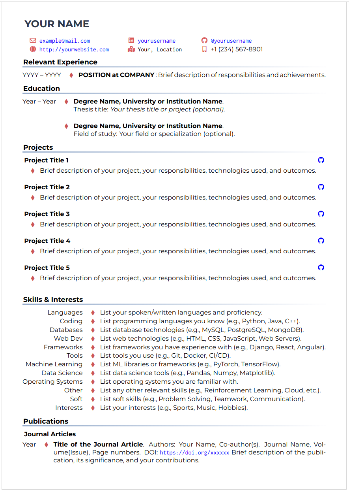
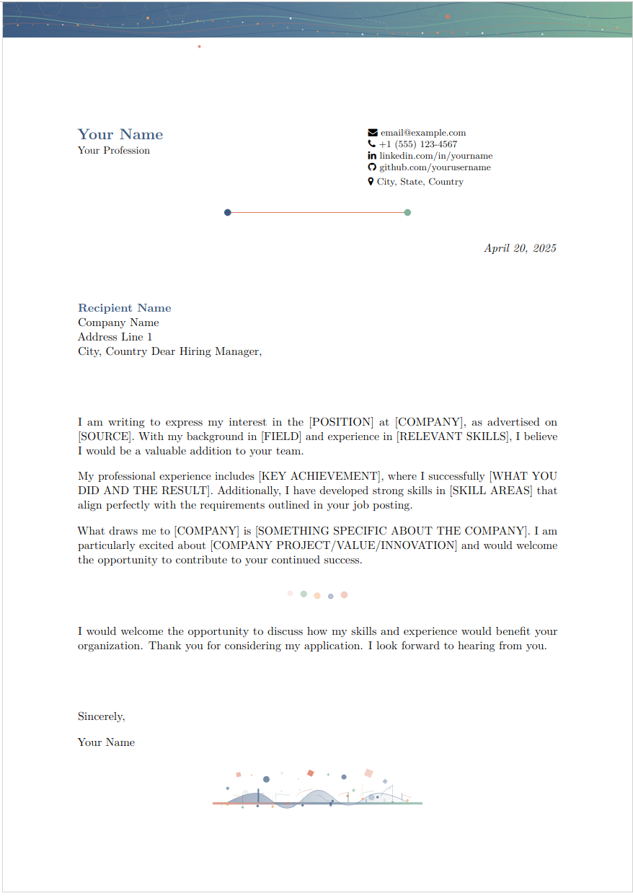

# CV & Cover Letter Repository

This repository contains a template Curriculum Vitae (CV) and cover letter, designed for easy customization and professional presentation.

## CV Template

The CV is based on the [LianTze Lim Customised Curve CV](https://www.overleaf.com/latex/templates/a-customised-curve-cv/mvmbhkwsnmwv) LaTeX template. This template provides a modern and visually appealing layout, making it suitable for a wide range of professional applications.

## Cover Letter Template

The repository includes a matching cover letter template that complements the CV design. The cover letter features a professional layout with customizable sections for recipient information, letter body, and contact details.

## Contents

- **CV Template**: LaTeX source files for the CV, adapted from LianTze Lim's template.
- **Cover Letter Template**: LaTeX source files for a matching cover letter.
- **PDF Outputs**: Compiled PDF versions of both the CV and cover letter for quick reference and sharing.

## Usage

1. Clone the repository.
2. Edit the LaTeX source files to update your personal information and content.
3. Compile the `.tex` files using your preferred LaTeX editor (e.g., Overleaf, TeXShop, or command-line tools).
4. The resulting PDFs will be generated for distribution or printing.

### Customization

- **CV**: Update the `skills.tex`, `employment.tex`, and other section files with your personal information.
- **Cover Letter**: Modify the `contacts.tex`, `recipient.tex`, and `body.tex` files to customize your letter content.

## Example Curriculum Vitae

## Example Cover Letter

## License

Please review the original template's license and ensure compliance if redistributing or modifying the template.

---
Template adapted from [LianTze Lim's Customised Curve CV](https://www.overleaf.com/latex/templates/a-customised-curve-cv/mvmbhkwsnmwv).

## Support My Work
If you find this template useful, consider supporting my work by renting pixels on my website.
[Rent a Pixel](https://nedo.im/pixels-rent/)
